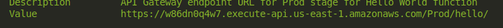

Este repositorio foi criado para documentar os estudos realizados sobre AWS.


# Sumário

- [Definindo um orçamento](##definindo-um-orçamento)
- [Politicas IAM](#politicas-iam)
- [S3](#s3)
- [EC2](#ec2)
- [Redes privadas VPC](#redes-privadas-vpc)
- [Monitoramento de serviços na AWS](#monitoramento-de-serviços-na-aws)
- [Utilizando o Amazon Route 53](#utilizando-o-amazon-route-53)
- [Cloudshell](#cloudshell)
- [CloudTrail](#cloudtrail)
- [Route 53 com Health Check](#route-53-com-health-check)
- [Amazon RDS](#amazon-rds)
- [Auto Scaling e Load Balancer](#auto-scaling-e-load-balancer)
- [Revisão de alguns conceitos](#revisao-de-alguns-conceitos)
- [Politicas de Auto Scaling Group](#politicas-de-auto-scaling-group)
- [IAM Roles](#iam-roles)
- [EBS, snapshots e EFS](#ebs-snapshots-e-efs)
- [AWS Lambda](#aws-lambda)
- [Teorema CAP e DynamoDB](#teorema-cap-e-dynamodb)
- [Banco de Dados em memória](#banco-de-dados-em-memória)
- [Mensageria na AWS](#mensageria-na-aws)
- [Amazon CloudFront](#amazon-cloudfront)
- [Protegendo e Otimizando um Bucket](#protegendo-e-otimizando-um-bucket)


## Definindo um orçamento

Acesse Billing and Cost Management e em Budgets crie um budget. A AWS disponibiliza templates de budgets. Para os nossos estudos foi criado um personalizado. É possível configurar um budget com
threshold de gastos definido por periodo (dia, mes etc) e serviço AWS (podendo definir um budget que se aplica a todos os serviços).

Tambem é possivel configura-lo para renovar periodicamente ou uma vez atingido esse budget ele se expire.


É recomendavel que além do budget voce também defina alertas que ao atingir (ou tambem estimar que atingirá) certo percentual do budget o alerta emite uma notificação por email.

Note que os alertas apenas notificam porem não executam ações. Para triggar uma ação é necessário configurar uma action. Para os estudos elas não serão criadas.


## Politicas IAM

Ao criar um conta na AWS, o usuario criado é um usuario root. Por questões de segurança é aconsenhavel adicionar um fator de autenticação para acesso ao usuario root. Além disso,
para o uso rotineiro dos serviços da AWS voce deve criar um usuario que não tenha acesso irrestrito como o usuario root.

Ao criar um usuario voce pode definir policies especificas a este usuario ou tambem adicionar um usuario a um grupo de modo que o usuario herde as permissoes definidas nesse grupo.

Criaremos um usuario atribuindo uma policy especificamente a ele. Para restrigir as permissoes
deste usuario a apenas ações operacionais foi atribuído a policy PowerUserAccess. Todas as polcies podem ser definidas por arquivos json e possuem uma estrutura básica que consiste em um ou mais "statements". Abaixo é possível visualizar a definição da policy 
PowerUserAccess:
```
{
    "Version": "2012-10-17",
    "Statement": [
        {
            "Effect": "Allow",
            "NotAction": [
                "iam:*",
                "organizations:*",
                "account:*"
            ],
            "Resource": "*"
        },
        {
            "Effect": "Allow",
            "Action": [
                "account:GetAccountInformation",
                "account:GetPrimaryEmail",
                "account:ListRegions",
                "iam:CreateServiceLinkedRole",
                "iam:DeleteServiceLinkedRole",
                "iam:ListRoles",
                "organizations:DescribeOrganization"
            ],
            "Resource": "*"
        }
    ]
}
```


Cada statement é composto por:
- Effect:  Define o efeito da policy, que pode ser "Allow" ou "Deny".
- Action/NotAction: Especifica quais ações são permitidas (ou não são permitidas)
- Resource: Define os recursos aos quais a policy se aplica. O asterisco (*) indica que se aplica a todos os recursos.

No exemplo mostrado o primeiro statment permite aplicar os efeitos as ações não especificadas em "NotAction". Para o segundo statment é permitido todas as ações sobre as actions descritas.

Um "Deny" explicito sempre terá prioridade sobre um "Allow" devido à sua capacidade.

Após criar um usuário voce pode criar uma acess key.


 Note que a forma recomendada pela AWS em muitos casos é criar uma "role", uma entidade que define um conjunto de permissões para realizar ações em recursos da AWS, sem associá-las diretamente a um usuário ou grupo específico. Ao contrário das IAM policies, que são regras que definem permissões, uma role é uma identidade da AWS que, quando assumida, concede temporariamente a quem a assume esses direitos.

As proximas ações descritas nessa documentação será utilizando o usuario criado.

## S3

O AWS S3 é um serviço de storage da AWS. Para utliza-ló é ncessario criar e configurar um bucket.

Ao criar um bucket voce pode configurar uma serie de atributos. Em geral, o comportamento desejado de um bucket é que seus arquivos armazenados não sejam 
públicos, porém para casos como a publicação de sites, ou disponibilização de imagens para acesso público é necessário desativar o Block Public.


Note que mesmo desativando o Block Public arquivos no bucket ainda permenecem privados. Para torna-los públicos você deve acessar Permissions e Bucket Policies.
Assim como as policies IAM, a policiy para um Bucket também pode ser configurada
via JSON.


```
{
  "Version": "2012-10-17",
  "Statement": [
    {
      "Sid":"PublicRead",
      "Effect": "Allow",
      "Principal": "*",
      "Action": ["s3:GetObject",
                 "s3:GetObjectVersion"
      ],
      "Resource": "arn:aws:s3:::studies-s3/*"
    }
  ]
}
```

Após isso os arquivos podem ser acessados por um usário anônimo, como por exemplo a [imagem](https://studies-s3.s3.us-east-1.amazonaws.com/corinthians.jpeg). 

Um ponto importante que deve ser considerado é que ao tentar acessar o link https://studies-s3.s3.us-east-1.amazonaws.com/ diretamente o S# entende isso como uma operação de listagem, a qual não foi atribuida permissão. Para configurar sites estáticos por exemplo acesse "properties" -> "Static website hosting" e ative (enable)
o seu uso. É possível configurar para o para o link redirecionar para um objeto do bucket (como um arquivo html) ou até mesmo outro link ou bucket.

## EC2

O EC2 é o serviço de computação em nuvem da AWS. Uma instancia do EC2 provisiona recursos
em 5 aspectos: cpu, memória, disco, rede, FPGA/GPU. As intâncias da familia t disponibilzam um recurso que caso a demanda esteja abaixo de determinado patamar créditos são acumulados.

Para rodar uma instância a amazon disponibiliza imagens (como amazon linux, ubuntu etc). 
Você pode usar imagens de terceiros (não verificados pela AWS) ou até mesmo construir sua própria imagem.

Em relação ao disco, existem diferentes opções para diferentes demandas. No caso de optar por um disco EBS mesmo após o pause da instância o disco será preservado (porém o hardware não, ao despausar ele alocará o volume EBS em outa máquina diferente do reboot que não desaloca o hardware). 


Entre outros configurações voce pode permitir o acesso a SHH, HTTP e HTTPS. Para recursos avançados vale mencionar EBS-optimized instance, que cria uma rede apenas
para comunição entre o EBS e a aplicação (obtendo melhor desempenho) e o User data 
que disponibiliza carregar um script para ser executado na primeira vez que a instância é configurada.

Caso opte por conectar por ssh utilize a chave privada gerada, o ec2-user é para o caso em que a imagem escolhida seja a Amazon Linux:
```
ssh -i ./name-ssh.pem ec2-user@public-ipv4-dns
```
Pode ser necessário reduzir as permissões da chave pem apenas para o usuário criador da chave, rode chmod 400.

Para criar uma imagem a partir da sua instância atual você pode selecionar Actions ->
Image and templates -> Create Image. A imagem não só mantém as configurações da instância como também mantém um snapshot com as os arquivos criados e instalados.

### Modo de seleção das instâncias

A AWS disponibiliza quatro modos de seleção das instâncias:

- On Demand: Modelo padrão, para imagens que utilizem Linux é cobrado por segundo utilizado.
-  Reserved Instance: Uma instancia é reservada por determinado tempo (de 1 a 3 anos)
implicando em menores taxas porém com pouco flexibilidade para troca de configurações da instância escolhida.
- Savings Plans: Ao invés de reservar uma instância especifica voce se compromete a gastar um valor especifico por hora, obtendo descontos em relação ao montante comprometido a ser gasto (maior flexibilidade que o Reserved Instance pois não necessariamente se compromete a reservar uma configuração especifica de instância).
- Instâncias Spot: Instâncias spot você negocia o uso de uma instância, se o valor proposto estiver acima do valor executado no momento (em geral bem abaixo do on demand e até mesmo em muitas situações abaixo do reserved instance)
a instância será atribuída a você, caso contrário a instância é interrompida (adequado para casos em que há redundância e não há problema em executar a instância em outro momento). 
- Host dedicado: Controle total sobre o host fisico onde é executado a instância (adequado para casos que necessitam compliance). Para obter esse controle as taxas executadas são maiores que as outras modalidades.

## Redes privadas VPC

Ao criar uma conta na AWS é criado uma VPC default, porém é possível configurar o seu próprio VPC, definindo sub-redes, se elas são privadas ou públicas, gateways, routes etc.

### Conceitos básicos de rede na AWS

A seguir será explicado alguns conceitos chaves para o entedimento e configuração de uma VPC.

Uma Virtual Private Cloud (VPC) é definido por região, dentro de uma região voce pode definir Availability Zones (AZs), que são  locais geograficamente separados dentro de uma região de um provedor de serviços da AWS. Cada AZ é composta por um ou mais data centers físicos, que são isolados uns dos outros para fornecer alta disponibilidade e resiliência contra falhas.

Em uma VPC voce pode definir sub-redes (publicas ou privads), cada sub-rede deve estar contida em uma única Availability Zone. Essa configuração permite que você controle a localização dos seus recursos. Por exemplo, você pode criar sub-redes em múltiplas AZs para garantir que seus aplicativos tenham alta disponibilidade e sejam resistentes a falhas.

Cada rota de comunicação entre as sub-redes e/ou internet gateway é definido pelo router, que redireciona a as rotas de comunicação. Por exemplo imagine que voce tem um frontend que consulta um banco de dados, por criterios de segurança e compliance
o banco de dados pode estar em um sub-rede privada que se comunica com o frontend.
O frontend por outro lado deve estar em uma sub-rede pública que se comnunica com o internet gateway. 

Para uma rede ter acesso a internet é necessário que ela tenha um IP público e uma rota pra um internet gateway. Também após o gateway pode ser configurado um Load Balancer que faz o gerencimaneto das requisições.

Para gerenciamneto de uma VPC existem dois aspectos:

- Security group: Definições sobre cada instancia EC2, é possível configurar aspectos como quais portas podem receber requisições etc. Nesse contexto tudo que deve ser permitido deve ser definido, caso não definido não é permitido.

- VACL's: Definições sobre a VPC, se aplica sobre a VPC. Pode ser definido o que é permitido e o que não é permitido.

### Criando uma VPC

Para criar uma VPC você deve escolher o número de AZs e o número de sub-redes públicas e privadas. Note na imagem abaixo que as duas AZs foram us-east-1a e 
us-east-1b.


Na imagem abaixo apresenta o preview de como fica a VPC com 2 AZs e 4 sub-redes (2 públicas e 2 privadas).


Dois aspectos que não serão abordados agora são NAT e VPC endpoints. Após criar a VPC todos os atributos são criados como abaixo:


Nas imagens abaixo mostram a configuração de um security group e uma ACL:


Após isso  é possível criar uma nova instancia atribuindo a ela um par de AZ e se ela é publico ou privada. Note também a opção de seleção de instancias spot, como o preço de instancias spot é sempre limitado por on demand sempre opte por instancias spot.


## Monitoramento de serviçoes na AWS


Para o monitoramento das instancias ec2 (ou outros serviços) é possível utilizar
o cloudwatch. O cloudwatch disponibiliza o monitoramente a cada 5 minutos de métricas
como o uso de memória, uso de cpu etc. A partir de tais métricas é possível implementar triggers como 
disparar alarmes por email utilizando o Amazon SNS ou até mesmo executar ações como parar uma instância
caso esteja com pouco uso. 

É possivel ativar no cloudwatch o detalhamento de métricas a cada 1 minuto (um custo adicional).
Para ativar o detalhamento selecione Manage detailed monitoring -> Enable. 

Vamos configurar um monitoramento que emite um alerta no email, crie um tópico em Amazon SNS,
selecione o topico criado e crie uma subscription que o protocolo é via email, isto é, ao alarme ser disparado é enviado um email (outras ações podem ser configuradas como fazer uma requisição, sms, Amazon SQS e Lambda).

Após isso, voltando para a seção em EC2 em Actions -> Monitor and troubleshoot -> Manage Cloudwatch Alarms voce pode criar um alarme, inclusive selecionando uma ação (como pausar uma instancia). Ao criar o alarme selecione o topico com a subscription criada.

Note que  ao criar um alarme voce pode configurar em Alarm action ações como Stop, reboot etc.

## Utilizando o Amazon Route 53

O Amazon Route 53 é um serviço DNS (Domain Name System) na nuvem altamente escalável e disponível, atua como um "diretor de tráfego" da Internet, facilitando a tradução de nomes de domínio(como www.exemplo.com) em endereços IP. Além do serviço DNS, o Route 53 oferece funcionalidades para registro de domínio e verificação de integridade.

Ao configurar uma instancia voce pode querer associar um dominio associado ao seu IP Public IPv4 address.
Para isso é necessário configurar algumas etapas:

- Alugar um dominio em Route 53
- Fixar um IP fixo a sua instancia. Toda vez que uma instancia é parada ao ser iniciada novamente por padrão será um IP Public diferente. Então na aba lateral de EC2 selecione Network & Security -> Elastic Ips -> Allocate Elastic IP adress. Após criar o IP selecione ele e em Actions -> Associate Elastic IP address, e então associe a instancia desejada. 
- Em Route 53 voce pode então associar o dominio ao IP criado criando um record, inserindo o IP.

## Roteamento de tráfego com o Amazon Route 53

O Amazon Route 53 oferece várias políticas de roteamento para gerenciar como o tráfego é direcionado para os seus recursos:

- Roteamento Simples: Esta é a política padrão e é usada quando você tem um único recurso que executa a função que você está roteando o tráfego.

- Roteamento Latência: Direciona os usuários para o recurso que oferece a menor latência de rede, ou seja, o recurso mais próximo em termos de tempo de resposta.

- Roteamento Ponderado: Permite distribuir o tráfego entre vários recursos na proporção que você especifica.
Caso de Uso: Útil para balanceamento de carga, testes A/B ou migrações graduais de sistemas.

- Roteamento Failover: Direciona o tráfego para um recurso primário a menos que ele esteja inativo, caso em que o tráfego será redirecionado para um recurso de backup.

- Roteamento Geo-localizado (Geolocation): Direciona o tráfego com base na localização geográfica dos usuários.

- Roteamento Geo-proximidade (Geoproximity): Direciona o tráfego com base na proximidade do usuário aos recursos, permitindo ajuste por "bias" para influenciar a escolha de roteamento.

- Roteamento Baseado em IP (IP-Based Routing): Direciona o tráfego com base no endereço IP do usuário.

##  Cloudshell

Por meio de terminal (AWS CLI) é possível interagir com os recursos da aws. No Cloudshell voce pode
verificar usuarios, listar buckets, verificar e executar instancias etc. Por exemplo voce pode listar os nomes
das regions para as instancias ec2:

```
>> aws ec2 describe-regions --query "Regions[].RegionName" --output text
```

Por padrão o output das respostas no AWS CLI é json.

Também é possivel utilizar o AWS CLI fora de ambientes da AWS, como no
seu computador. Para conectar ao seu usuario da AWS CLI, após sua instalação:

```
aws configure 
```
E insira a ACCESS_KEY e a SECRET_KEY. No  [link](https://awscli.amazonaws.com/v2/documentation/api/latest/reference/index.html)
apresenta a documentação referente aos comandos.

## CloudTrail

Para rastrear todas as chamadas de API realizadas nos seus serviços a AWS disponibiliza
o CloudTrail, que monitora as chamadas e registra os logs em um bucket da AWS.

Para isso é necessário criar um trail (configurado por região). Os recursos disponiveis são:

- Gerenciamento dos recursos: Capturar as repostas dos eventos.
- Data events: Respostas das chamadas das API's
- Insights: Recursos que detectam eventos de segurança (como numero de chamadas atipicas etc).

## Route 53 com Health Check

Outro recurso de monitoramento que a AWS disponibiliza é o uso de  Health Check no Route 53.
Ao associar um dominio a um IP é possivel configurar o Health Check. Nele é possível verificar
os endpoints e emitir alertas em casos de falha ou caso não esteja disponivel.

## Amazon RDS

A aws fornece o o serviço Amazon RDS para o uso de banco de dados relacionais. O processo
de criação de uma Database (seja MySQL, Postgres, Oracle etc) é parecido com a criação de uma instancia
EC2. Além das configurações especificas para um database, atente se para a criação de um security group
na vpc selecionada com permissão a comunicação na porta configurada para o Database (por exemplo no caso do
postgres 5432). Em geral, utilize o database em uma subrede privada.

Após isso a criação é possível utilizar o dabatase normalmente.

## Auto Scaling e Load Balancer

Para garantir disponibilidade no EC2 (e também escabilidade e performace)  podemos deixar configurado
o scaling group, que no caso de uma instancia cair ele ira garantir que uma copia seja instanciada e sempre
tenha um numero especificado de instancias EC2 disponivel (ou dentro de um intervalo definido).

Antes disso vamos configurar um Launch template (que será utilizado pelo scaling group). Em ec2
selecione Launch Template e Create template. Ao criar o Launch Template selecione
Auto Scaling guidance como na figura abaixo:


Não é necessário selecionar a subnet que o Lunch template será criado (isso pode ser configurado no auto scaling group), porém é necessário selecionar uma VPC. 

Um ponto muito importante é que na configuração auto scaling, a subnet escolhida deve estar
com auto-assign public IPv4 address ativado. Essa configuração é necessária pois ao contrário
de criar uma instancia no EC2 que por padrão vem com o auto-assing public IP ativado como na figura abaixo (logo mesmo que uma instancia seja criada em um subnet publica se ela nao tiver um IP publico não será possível acessa-la publicamente).  


Ao selecionar uma subnet publica o Auto-assign public IPv4 address padrão
será No:


Para ativar siga os passos Actions ->  Edit subnet settings -> Enable auto-assign public IPv4 address.


Com essa configuração, as instancias (e Launch template) criadas em tal subnet 
possuirá um IP publico. Também lembre de criar ou adicionar um security group
para o Launch Template.

Após criar o Launch template é possível configurar o Auto Scaling Group. Selecione em EC2 -> Auto Scale Groups -> Create Auto Scale Group.

Na criação selecione mais de uma AZ (não é necessário ativar o Load Balancer ainda).
No auto scaling group é possível selecionar as quantidades de instancias do Launch Template desejadas, minimas e maximas


Após a criação será iniciado uma instancia. Assim, devido ao auto scaling group mesmo se voce terminar tal instancia ela sera substituida por uma nova.

Para distribuir as chamadas entre difentes instancias configure o Load Balancer e ao definir
o auto scaling group associe o Load balancer. Apesar da configuração ser simples preste muita atenção nas configurações (principalemnte relacionadas a VPC e security group).

Na proxima seção é feito uma revisão dos principais conceitos sobre alta disponibilidade.

## Revisão de alguns conceitos

- Launch Template: Template definido para o auto scaling. Nesse são configurados
atributos que serão utilizados pelo AutoScaling Group para criar e manter as instancias.

- Auto Scaling Group: Configuração que cria e mantem as instancias definidas no Launch Template. Possui configurações para definir intervalos de instancias que devem estar disponiveis e configurações para associar ao Load Balancer/Target Group. Ao definir um 
Load Balancer voce deve atribuir a um ou mais dos seus target groups, dessa forma  

- Load Balancer: Distribui as "requisições" entre as instancias (a forma de distribuição é configuravel). As instancias que receberão a distribuição de carga são definidas ao atribuir um target group. Quando definido o Load Balancer é possivel associar regras como por exemplo 
uma requisição de um usuario especifico é mantida sempre em uma instancia (por exemplo para perimitir o uso de cookies etc).

- Target group: Definição das "intancias" que receberão a distribuição do Load Balancer.
  Note que a instancia nao é criada aqui, apenas configurado atributos necessarios para o Load Balancer. Além disso, o target group pode ser definido para funções Lambda, IP (como containers), ou outros load balancers. 

  Ao criar um um target group é possível associar as instancias (ou IP's etc) que o target group conterá, apesar disso, o padrão é deixar essa associação no scaling group,
  pois de fato é onde será criada as instancias. 

- Security Group: Configuração atribuida a instancias, launch templates, Load Balancer e outros security groups. Seu objetivo é definir quais as portas e protocolos
de comunicação permitidos.

Lembre-se que todos esses conceitos estão definidos sobre um rede VPC que deve ser criada previamente.


## Politicas de Auto Scaling Group

Um das funcionalidades que o Auto Scaling perimite é o escalonamento dinaminco de instancias.
Este escalonamento pode ser triggado por tres formas diferentes:

 - Scheduled actions: Agenda os intervalos de instancias (minimo, maximo e desired). Com o a definição de um cron são executados as especificações e minimo, maximo e desired (atenção ao definir tais valores pois eles sobrescrevem os definidos anteriormente). A especificação de instancias ocorre por ação, dessa forma para aumentar o numeor de instancias deve ser agendado um cron e para diminuir deve ser agendado outro cron. Por exemplo, caso voce queira executar um processo as 3h da manha e finaliza-lo as 7h da manha voce deve agendar um cron para subir/aumentar o numero de instancias e a agendar um cron as  7h para diminuir/derrubar as intancias.

  

  - Dynamic scaling policies: Define as politicas de escalonamento dinamicamente, baseados em triggers como alertas. Como exemplo vamos um configurar um alerta para utilizar como paramentro para utilização de um auto scaling group. Selecione o Auto scaling group -> Monitoring. Selecione alguns das graficos (nesse exemplo em EC@ foi escolhido CPU Utilization (Percent) que apresenta a utilização média da CPU  nas instancas) e visualize as metricas no cloudwatch:

    

    Selecione create alarm (sino):

    

    Na definição de um alarme existem diferentes parametros como o tipo da métrica (Average, Min, Max, Sum etc), intervalo de tempo, o limiar utilizado (Threshold) etc. Dessa forma, tais alarmes podem ser utilizados tanto para momentos de alta demanda como pouca demanda.

    

    Apos criar o alarme em Dynamic scaling policies voce pode definir a politica de auto scaling:

    

    Dentre as configurações temos o policy type:
    
    - Target tracking scaling (não é necessário definir um alarme): Ajusta de forma automatica a quantidade de intancias para tentar atingir o target value informado.

    - Simple Scaling: Ao atingir as condilçoes que disparam o alarme executa uma ação (adiciona, diminui, ou ajusta para um valor especifico de instancias a seram utilizadas no auto scaling group).

    - Step scalling: Toma ações baseadas em etapas, por exemplo se atingir o percentual de  50% de utilização média de cpu adiciona uma instancia, se atingir o percentual de 70% adiciona (diminui) duas instancia etc. 
    
    Para testar o dynamic auto sacling foi executado em uma das intancias:
    ```
    sudo yum install stress -y
    stress --cpu 1
    ```

 - Predictive scaling policies: Similar o Dynamic auo scaling porém tiliza modelos preditivos que disparam o alarme antes dele ocorrer.

**Obs**: Como são muitas configurações é muito facil esquecer de algum detalhe e passar despercebido alguma configuração, dessa forma uma abordagem é utilizar o terraform
que levanta a infraestrura na cloud a partir de arquivos de configuração. Além disso, como sugestão sempre preste muita atenção nas configurações dos security groups, garatindo que as permissoes para inbound (qual o trafico de entrada permitido) e outbound (qual o trafico de saida permitido) estão corretas e as configurações de VPC, em
particular das subnets (mesmo em casos em que a subnet é publica o route table que ela referencia deve estar conectado a um internet gateway). 

  


  


  


Note que todos os conceitos apresentados anteriormente foram aplicados com o objetivo de desenvolver aplicaçoes com alta disponibildade e tolerância a falhas, de modo que se ocorrer algum
imprevisto o sistema tenha capacidade de suportar tal evento. Porém deve se notar que em uma aplicação todos os sitemas integrados devem ter redundancia (como por exemplo o banco de dados).

## IAM Roles

Um recurso para autenticação fornecido pela AWS são as roles. Sua aplicação se justifica em casos em que serviçoes dentro do ambiente da aws precisam
acesso a outros serviços. Dessa modo, é possível criar uma role adicionando uma ou mais policies e associar essa role a este serviço. Internamente a
aws fara o gerencimento do acesso, atribuindo ACCESS KEYS e SECRET KEYS temporarias (gerenciada por meio de um token) e automaticamente são renovadas.
Antes de atribuir a role ao serviço EC2 para acessar o S3:


Após atribuir a role:


Também é possível atribuir roles a usuarios, com um modo de funciomamento um pouco diferente, ao associar uma role a um usuario o periodo de validade máximo de permissão é 12 horas.Portanto sua utilização se justifica para casos em que o acesso deve ocorrer por um periodo curto de tempo. Paro atribuir uma role a um usuario nas policies atribuidas ao usuario
deve ser adicionado constar a permissão de assumir essa policy, como no exemplo abaixo, em que permite o assumir a role definda em Resource:
```
{
  "Version": "2012-10-17",
  "Statement": [
    {
      "Effect": "Allow",
      "Action": "sts:AssumeRole",
      "Resource": "arn:aws:iam::765432109876:role/DeveloperProductionAccess" 
    }
  ]
}
```
Após atribuir a role ao usuario, é possivel acessar o recurso permitido atraves do link
gerado no role (com o usuario a qual a role foi atribuida logado):


## EBS, snapshots e EFS

Para um tipo de instancia há dois tipos de storage:

- Instance Storage: Storage local, é efemero (se pausar a instância o volume não se mantem ao reiniciar), a capacidade do tamnho é fixa, e o custo é incluído.
- EBS: Volume, durável, o tamanho de armazenamento é configuravel, custos computados separadamente. Como a instancia comunica com o EBS via uma rede, o 
  que pode gerar concorrência de rede com outras necessidades da instancia, para isso existem instancias EBS optimizer,  que possui uma interface de rede apenas para comunicação com o EBS.

Para o EBS voce pode criar snapshots, que são backups que são armazenados no S3. O construção desses snapshots funcionam como "ponteiros", isso é, ao realizar um segundo snapshot ele vai aproveitar o snapshot anterior, apontando para o anterior e criando um espaço de memoria novo que também é apontado (com os novos dados). Dessa forma, mesmo que você apague uma versão de um snapshot ainda pode haver dados dele no S# (sendo utilizados por outra versão de um snapshot). Os snapshots sãp pagos separadamente do EBS, além disso é possível adicionar regras de gerenciamento desses snapshots (como por exemplo apagar os snapshots com mais de um mês). 

Existe uma funionalidade que referencia um EBS para mais de uma instância. Em geral, é realizado o snapshot quando a instancia está pausada, para não passar mais o snapshotvariaveis de ambiente momentâneas. No EBS também é possível configurar o número de IOPS necessário e deve ser criado na mesma AZ que a instância.

Obs: Ao criar um EBS e associar uma instancia voce deve formata-lo e montar o EBS em um diretorio do EC2, por exemplo se o EBS recebeu o nome /dev/sdf:

```bash
mkfs.ext4 /dev/sdf
mkdir io2
mount /dev/sdf io2/
```

A aws disponibiliza um file system que pode ser utilizado entre diferentes instcnais de AZ diferentes chamado EFS.


## AWS Lambda

A AWS forneceum serviço serveless orientado a eventos chamado AWS Lambda. Pela interface gráfica é possível criar uma função
de forma muito simples. Uma função utilizando python no Lambda terá o seguinte formato:

```python
import json

def lambda_handler(event, context):
    # TODO implement
    return {
        'statusCode': 200,
        'body': json.dumps('Hello!')
    }
```

O event é um dicionário que contém dados de entrada fornecidos ao Lambda quando o evento é acionado. Esse evento pode vir de várias fontes, como Amazon API Gateway, Amazon S3, Amazon SNS, AWS Step Functions, entre outros. O formato e o conteúdo do objeto event variam dependendo da origem do evento.
Por exemplo, se o Lambda for invocado por meio do API Gateway, o event incluirá informações como o caminho da requisição, os parâmetros de consulta, cabeçalhos, e o corpo da requisição. O exemplo de documento que você mencionou para integração proxy é útil para entender o formato esperado quando o evento vem do API Gateway.

O context é um objeto fornecido pelo AWS Lambda que contém informações sobre a execução da função, como tempo limite de execução, memória alocada, ID da requisição (invocation ID), e o nome da função Lambda.

Também é possível configurar uma função no Lambda a partir do terminal (com o AWS CLI configurado), por exemplo:
```bash
sam init -n demo -r python3.13
cd demo
sam deploy -g
```

Após a configuração padrão será criada a pasta demo. Em demo/hello_world/app.py é definido a função Lambda. Aspectos de configuração do Lambda são definidos em demo/template.yaml, esse aquivo yml segue um padrão para o CloudFormation. Após a execução do template HelloWorld a API Gateway disponibilizará um endereço para disparar o evento.



## Teorema CAP e DynamoDB

O Teorema CAP afirma que é impossível para um sistema distribuído fornecer simultaneamente todas as três garantias a seguir:

- Consistência (Consistency): Todas as réplicas de dados no sistema parecem iguais a qualquer cliente que acesse o sistema em um determinado momento.

- Disponibilidade (Availability): Todo pedido de um cliente recebe uma resposta, seja ela correta ou não.

- Tolerância a Partições (Partition Tolerance): O sistema continua a operar, mesmo que algumas das mensagens entre os nós sejam perdidas ou atrasadas (ou seja, o sistema pode lidar com a divisão da rede em sub-redes).

De acordo com o teorema, apenas dois dos três requisitos podem ser garantidos ao mesmo tempo. Na cloud (e portanto com Tolerância a Partições), situações em que há uma quebra na
conectividade entre os sistemas implicarão impactando ou na consitência
ou na disponibilidade. 

Uma forma de minizar os efeitos de uma quebra de comunicação é adicionando redudância (com múltiplos servidores e com replicação de um mesmo dado para cada AZ). Dessa forma implica no que é chamado em consistência eventual, quando for reestabelecido a comunicação o sistema voltará a ser consistente.


Para lidar com a estrégia de partição o DynamoDB disponibilza duas key:

- Partition Key: Chave utilizada para determinar como os dados serão particionados.
- Sort Key (Optional): Chave utilizada para determinar a ordem que os dados serão particionados (também há chaves secundárias).

Por exemplo: Imagine uma aplicação que armazena informações sobre pedidos de compras de clientes em uma tabela intitulada Pedidos. A tabela Pedidos pode ser configurada da seguinte forma:

- Chave de Partição: ClienteID
- Chave de Ordenação: PedidoID

Nesse caso, ClienteID atua como a chave de partição. Isso significa que todos os pedidos feitos por um mesmo cliente serão agrupados e armazenados na mesma partição, mas cada pedido individual é distinguido por PedidoID, que é a chave de ordenação.

Na configuração do DynamoDB é possível optar por:

- Consistência Eventual (Eventually Consistent): Este é o comportamento padrão do DynamoDB e é recomendado quando a aplicação pode tolerar uma leitura que não reflete imediatamente a última gravação. Ele oferece baixa latência e maior taxa de transferência (mais barato).

- Consistência Forte (Strongly Consistent): Ideal para aplicações que requerem garantias estritas sobre a precisão dos dados, porém, isso pode impactar na latência e taxa de transferência, já que todas as partições precisam estar sincronizadas antes do retorno da leitura.

- Leituras de Transações (Transactional Reads): Isso garante que todas as operações na transação sejam bem-sucedidas ou nenhuma delas seja aplicada. Utilizado quando múltiplas operações precisam ser tratadas como uma única unidade, com total garantias de atomicidade, consistência, isolamento e durabilidade (ACID).

## Banco de Dados em Memória 

Para casos em em que a consulta ao banco de dados deve ser realizado em menos de um milissegundo:

- ElastiCache: Engine que disponibiliza banco de dados em memória. O mais popular é o Redis (baseado em chave valor).

- MemoryDB: "Redis" desnvolvido pela AWS. Mais otimizado que o Redis do ElastiCache.

- Dax: Possui integração nativa ao DynamoDB, dessa forma ao configurar o client do DynamoDB em alguma linguagem é possível por optar pela verificação do DAX como primeira etapa (para otimizar os resultados do DynamoDB).

Como bando de dados devem sempre ter replicação caso contrário se um cluster for interrompido esse dado será perdido.

## Mensageria na AWS

SQS - O Amazon Simple Queue Service (SQS) é um serviço da AWS que oferece uma solução gerenciada e altamente escalável para filas de mensagens. O SQS permite que diferentes componentes de um sistema de software se comuniquem uns com os outros de maneira assíncrona e desacoplada

 

Devido ao Teorema CAP pode haver casos em que deve se optar entre consistência e disponibilidade. Dessa forma há duas configurações para o SQS:

- Standard Queues: Oferecem throughput ilimitado e são ideais para casos em que a ordem exata e o processamento único de mensagens não são críticos.
Garantem que cada mensagem será entregue pelo menos uma vez, embora possam haver duplicatas de mensagens.
A ordem de mensagens pode ser eventualmente alterada.

- FIFO Queues: Preservam a ordem exata das mensagens e garantem que cada mensagem seja processada apenas uma vez.
São ideais para aplicações onde a ordem das operações e eventos é crucial.
Possuem throughput mais limitado em comparação com filas Standard, mas oferecem uma entrega rigorosa com processamento único de mensagens.

Dentre os parametros configuraveis no SQS é valido mencionar o tempo maximo que uma mensagem pode ficar na Queue (até um producer pegar essa mensagem), o tempo máximo de processamento para cada mensagem (no caso de falha essa mensagem volta para a fila), o número máximo de de tentativas de processamento de uma mensagem e a configuração de uma fila auxiliar (DLQ) que armazena as mensagens que o número de tentativas excedeu o número máximo de tentativas (para controle e monitoramento do fluxo).

SNS - Funciona como um serviço de pub/sub, onde as mensagens são enviadas para múltiplos consumers através de tópicos. Possui suporte a diferentes endpoints (email, SMS, Kineses, SQS, Lambda etc). Assim como o SQS é serveless e possui a configuração Standard e FIFO.

Amazon MQ: Engine de broker da AWS, possui duas opões: RabbitMQ e o ActiveMQ.

Amazon Kineses: Broker da AWS qu como o Kafka é utilizado para streamming, altamente configurável e escalável. 

Tanto o Amazon MQ quanto o Kineses não são serveless.

## Amazon CloudFront

Na AWS existe o conceito de Edge Locations, que são locais intermediarios entre a AZ e o usuario que tem como objetivo otimizar o tempo e uso de recursos para o acesso a instancias no EC2.

Para utilizar os edge locations voce deve configurar um dominio no Amazon CloudFront. Assim, o tempo de resposta de suas requisições serão otimizadas, e haverá um melhor uso de recursos pois no edge location ficará armazenado o cache da sua aplicação, aliviando o uso da sua instancia no EC2. Além disso,
o  Amazon CloudFront disponibiliza recursos de segurança como a ataques DDOS.

Mesmo que a sua aplicação no EC2 não contenha informacações estaticas (e portanto o cache não será tão útil) o Amazon CloudFront melhorara o tempo de resposta pois a comuniação entre o edge location e a AZ é otimizada.

Além disso, é possível segmentar o conteúdo entre estastico e dinamico, armazenando o conteudo estatico no cache no edge location. O CloudFront possui um recurso chamado Origins, onde voce especifica a origin das informações (como o S3, loadbalancer ou a própria instância). Para configurar a forma que a origin é usada basta explicitar a regra em Behavior. Ao utilizar o S3 como um Origin você possibilita o uso dessas informações para aplicações globais (ao contrário de uma instância que é por meio de uma AZ).

Ao criar uma distribuição no Amazon CloudFront, ele gera automaticamente um nome de domínio próprio para essa distribuição, algo como abcdef123456.cloudfront.net. No entanto, você pode configurar para usar seu próprio domínio registrado no Amazon Route 53 como o domínio alternativo para a distribuição do CloudFront. Isso se faz através das configurações de domínio alternativo (CNAME) no CloudFront.

## Protegendo e Otimizando um Bucket

Relembrando configurações anteriores do S3, ao utilizarmos imagens em sites nos deixamos o bucket público, o que poder ser um ponto de falha de segurança. Para isso é possível configurar esse bucket como privado e liberar o acesso ao CloudFront (por meio de policies). Dessa forma, o acesso direto as imagens não é permitido porém ainda sim é possível utilizar em sites.

Outro ponto de configuração de um Bucket são os acess points, que são formas secundárias
de configuração de um bucket, dessa forma diferentes aplicações podem utilizar um mesmo Bucket (com diferentes configurações) sem ser necessário replicar os dados para um novo Bucket.

Para otimizar a tranferência de arquivos no S3 (principalmente para objetos maiores e para lugares mais distantes) é possível habilitar o S3 transfer acceleration, recurso esse que utilizará os edge locations para upload e download dos objetos. O custo de leitura é o mesmo porém ele passará a cobrar a escrita.

Ao habilitar o transfer acceleration será criado um novo endpoint da API do S3 para o bucket em questão.